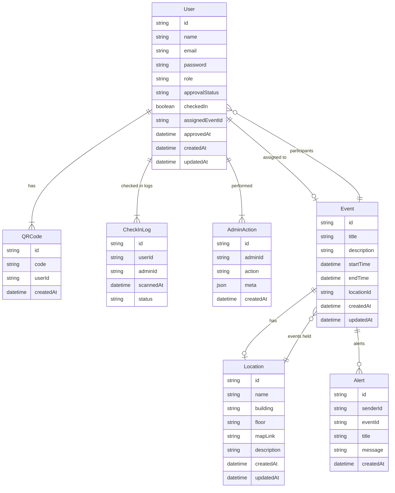

# **Database Schema(ERD)**

---

# This ERD Covers:

* Users (roles: participant/admin)
* QR Codes
* Check-in approval logs
* Event allocations
* Locations
* Alerts system
* Admin audit log
* Full relationship mapping (one-to-one, one-to-many, many-to-many)

